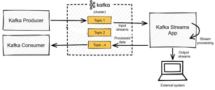
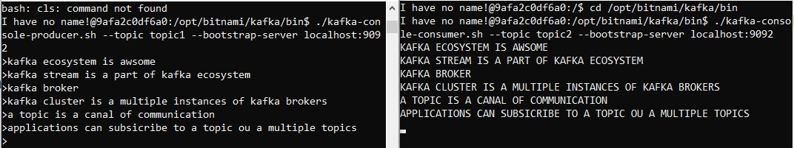

<h1>
🧠 Realtime Text Capitalizer
</h1>

Cette application à pour objectif d'éxploiter et de comprendre l'architecture de base d'un 
`cluster kafka` composé d'un seul noeud `Broker` et sa relation avec `Kafka Stream`
<h3>
🎓 Architecture de l'application ?
</h3>

<p> 
1 - Kafka Producer publie du texte dans un `Topic` du `Broker Kafka`, nommé "Topic1"
</p>
<p>
2 - ... puis, Kafka Stream reçoie ce message à partire de `Input Stream` (flux d'entrée)
</p>
<p>
3 - ... elle transforme ce message en majuscule
</p>
<p>
4 - ... puis, elle le publie vers `Topic2`  
</p>
<p>
5 - En fin, et puisque Kafka Consumer et abonné à Topic2, alors il va recevoire ce message tansformé en 
majuscule  
</p>

<h3>
🚀 Réalisation
</h3>

1 - Cloner le repository (si ce n'est pas déjà fait)
```
git clone https://github.com/iliasseAbdessamad/TPs_Kafka_Streams.git
```

2 - Lancer le Boker Kafka (assurez vous que vous être dans TPs_Kafka_Streams)
```
docker compose up -d
```

3 - Lister les conteneurs en état `running`
```
docker ps
```
Vous devez avoir la sortie suivante : 


4 - Accéder au conteneur qui hebèrge de `Broker Kafka`
```
docker exec -it kafka /bin/bash
```

5 - Accéder au repertoire qui contient les scripts de `Kafka`
```
cd /opt/bitnami/kafka/bin
```

6 - Créer un `Topic` nommé  "topic1"
```
./kafka-topics.sh --create --topic topic1 --bootstrap-server localhost:9092 --partitions 1 --replication-factor 1
```

7 - Créer un autre `Topic` avec comme nom, "topic2"
```
./kafka-topics.sh --create --topic topic2 --bootstrap-server localhost:9092 --partitions 1 --replication-factor 1
```

9 - Lancer l'application (de préférable, avec intellij)

10 - Lancer et abonner `Kafka Poducer CLI` au topic1 (ouvrez une autre console)
```
./kafka-console-producer.sh --topic topic1 --bootstrap-server localhost:9092
```

11 - Lancer et abonner `Kafka Consumer CLI` au topic2 (ouvrez une autre console, accéder au conteneur kafka, puis au répertoire 
qui contient les scripts Kafka (voir étape 4 et 5), puis tapez la commande suivante) 
```
./kafka-console-consumer.sh --topic topic2 --bootstrap-server localhost:9092
```

12 - Poduire un message dans le `Topic` topic1 via `Kafka Producer CLI` (en saissant un texte dans 
la console du `Producer CLI`)

13 - Consuler `Kafka Consumer CLI` (vous devez voir le texte en MAJUSCULE)

<b>
Démo : 
<b>


<br />
<h3>💡 Conclusion</h3>
<p>
`Kafka Streams`est un composant de l'écosystème `Kafka`, son rôle de base est de rediriger les messages 
entre les `Topics` d'un `Cluster de Brokers Kafka`.
</p>
<p>
Le combo `Kafka Streams` + `Topics` + `Boker Kafka` permet de : 
</p>
<ul>
<li>Faire le `Stream Processing` (Le traitement en temps réel).</li>
<li>Implémenter une communication asynchrones entre les microservices ou les applications</li>
</ul>

<p>
Le combo `Kafka Streams` + `Topics` + `Cluster de Broker Kafka` permet de faire tous ça sur une très 
grande masse données, de structures variées, qui se produisent avec une grande vitesse  
</p>
 

<br />
<p>
💻 Réalisateur : Abdessamad Iliasse 
</p>
<p>
📅 Année : 2024 - 2025
</p>
<p>
📚 Sujet : Kafka Streams 
</p>


 
