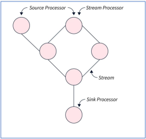
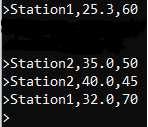
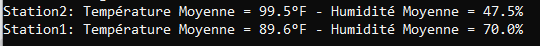

<h1>🧠 Realtime Weather Processing</h1>

Une application basé sur <b>Kafka Streams</b> qui permet de lire les données météorologiques de différentes
stations météorologiques depuis le <b>Topic "weather-data"</h1> , de traiter ces données, 
et de les produire dans un autre topic Kafka ("satation-averages") prêtes à être consomées.
<br />


<h3>🎓 L'Objectif de ce TP</h3>
est de distinguer entre les 3 type de flux de données (data streams) dans une application 
<b>Kafka Streams</b>, et de pouvoir établir une <b>Processors Topology</b>, qui représente la séquence de processus 
repésentant la logique de traitement des données dans une application <b>Kafka Streams</b>

<br />


<ul>
<li><b>Source Processor</b> : Point d'entrée de la topology, lisant les messages depuis un topic Kafka</li>
<li><b>Stream Processor</b> : Applique des transformations ou des opérations comme le filtrage, l'agrégation ou les jointures...</li>
<li><b>Sink Processor :</b> : Point de sortie, produit les résultats dans un autre topic Kafka.</li>
</ul>
Dans une Pipline Kafka Streams, les données circulent d'un processeurs vers un autre

<h3>🚀 Réalisation</h3>

1 - Cloner le repository (si ce n'est pas déjà fait)
```
git clone https://github.com/iliasseAbdessamad/TPs_Kafka_Streams.git
```

2 - Lancer le broker kafka (assurez vous que vous être dans TPs_Kafka_Streams)
```
docker compose up -d
```

3 - Accéder au conteneur qui hebèrge `Kafka`
```
docker exec -it kafka /bin/bash
```

4 - Créer un topic nommé `weather-data` , et un autre topic nommé `station-averages` 
```
./kafka-topics.sh --create --topic weather-data --bootstrap-server localhost:9092 --partitions 1 --replication-factor 1
./kafka-topics.sh --create --topic station-averages --bootstrap-server localhost:9092 --partitions 1 --replication-factor 1
```

5 - Lancer l'application (de préférable, avec intellij)

6 - Lancer et abonner Kafka Poducer CLI au topic `weather-data`
```
./kafka-console-producer.sh --topic weather-data --bootstrap-server localhost:9092
```

7 - Via Kafka Producer CLI, publier un message avec le format suivant `station,températureEnCelcius,humidité` , exp (notez qu'il faut produire les messages, ligne par ligne):
```
Station1,25.3,60
Station2,35.0,50
Station2,40.0,45
Station1,32.0,70
```

8 - Lancer et abonner Kafka Consumer CLI au topic `station-averages` pour voir visualiser le résultat
```
./kafka-console-consumer.sh --topic station-averages --bootstrap-server localhost:9092 --from-beginning
```

<br />
<h3>Demo</h3>
<p><b>Kafka Producer CLI (From here you may publish data to weather-data topic)</b></p>


<p><b>Kafka Consumer CLI (From here you may read data from station-averages topic)</b></p>


<br />
<hr />
<br />

<p>💻 Réalisé par : Abdessamad Iliasse</p>
<p>📚 Sujet : Piplines Kafka Streams (Niveau basique)</p>
<p>📅 Année : 2024 - 2025</p>


